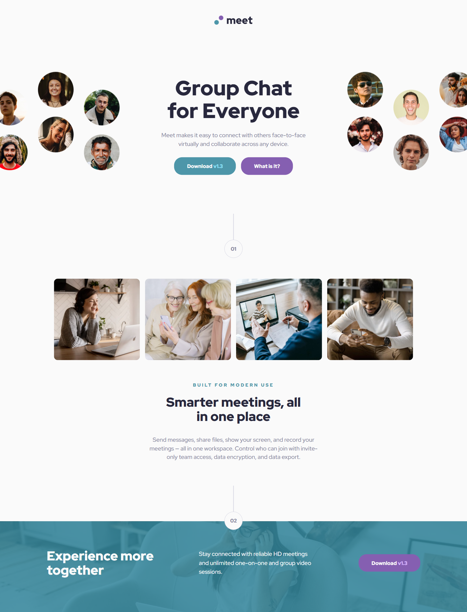
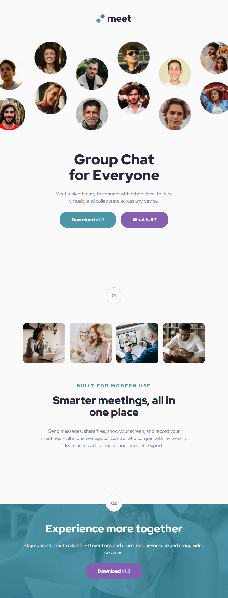
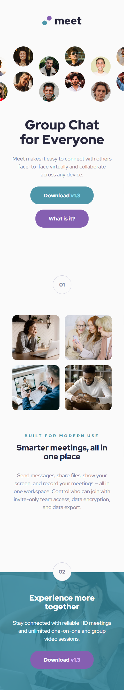

# Frontend Mentor - Meet landing page solution

This is a solution to the [Meet landing page challenge on Frontend Mentor](https://www.frontendmentor.io/challenges/meet-landing-page-rbTDS6OUR). Frontend Mentor challenges help you improve your coding skills by building realistic projects.

## Table of contents

- [Overview](#overview)
  - [The challenge](#the-challenge)
  - [Screenshot](#screenshot)
  - [Links](#links)
- [My process](#my-process)
  - [Built with](#built-with)
  - [What I learned](#what-i-learned)
  - [Continued development](#continued-development)
- [Author](#author)
- [Acknowledgments](#acknowledgments)

## Overview

### The challenge

Users should be able to:

- View the optimal layout depending on their device's screen size
- See hover states for interactive elements

### Screenshot

#### Desktop View

#### Tablet View

#### Mobile View

### Links

- Solution URL: [Github Repo](https://github.com/jjurelvalenzuela/meet-landing-page)
- Live Site URL: [Meet Landing Page](https://jbuast-meet-landing-page.netlify.app/)

## My process

### Built with

- Semantic HTML5 markup
- CSS custom properties (variables)
- Flexbox
- Mobile-first workflow

### What I learned

Building my first major web development project as a beginner taught me several important lessons.
It’s easy to get overwhelmed or obsessed with making everything perfect. I learned not to stress over every minor detail, but to focus on making the website as close as possible to the provided design.
Perfectionism can actually slow you down and hurt motivation—progress is more important!

Organization was another challenge. I relied on AI assistance, but ultimately I had to make logical, personal decisions for my code. Not every suggestion from AI fits every situation, so it's important to trust your own judgment and aim for code that's easy to read and understand.

### Continued development

Time management is an area I’d like to improve. I spent about a day and a half building the project, but then needed to go back, reread, and refactor my code to reduce redundancy and follow DRY (Don't Repeat Yourself) principles.
I'm trying to make it a habit to finish my work cleanly—organized, readable, and maintainable for myself and for any other developers who might look at my code. I believe these habits will make my workflow easier in the long run and help me become job-ready.

## Author

- Frontend Mentor - [@jjurelvalenzuela](https://www.frontendmentor.io/profile/jjurelvalenzuela)
- Github - [jjurelvalenzuela](https://github.com/jjurelvalenzuela)

## Acknowledgments

I'm really proud that I pushed through and finished this project!
This experience has fueled my motivation to pursue a career as a web developer.
Looking back, I'm grateful to my current self for staying motivated and putting in the work. One day, I hope to revisit this project—not just as a junior developer, but as a senior dev who has grown in the industry.
